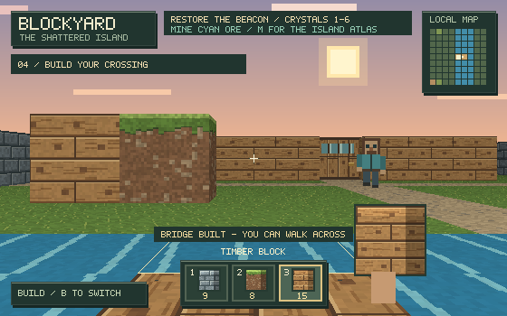

<div align="center">

# BLOCKYARD

### The Shattered Island

**Explore a little world. Mine your materials. Build your way across.**

A Minecraft-inspired island adventure built in C on top of a cub3D raycaster.

**C &nbsp; / &nbsp; MiniLibX &nbsp; / &nbsp; macOS &nbsp; / &nbsp; Raycasting**

[Watch](#gameplay-video) · [Play](#quick-start) · [The adventure](#the-adventure) · [Controls](#controls) · [Under the hood](#under-the-hood) · [Raycasting explained](#how-the-raycaster-works)

</div>

[](docs/media/blockyard-showcase.mp4)

<p align="center"><em>A sunset, an unfinished bridge, and an island waiting to be explored.</em></p>

---

## Gameplay video

[](docs/media/blockyard-showcase.mp4)

**[Watch the 20-second showcase →](docs/media/blockyard-showcase.mp4)**

A silent, scripted tour captured from the actual game renderer: explore the village,
mine crystal ore, open a door, build a river crossing, and view the island atlas.
The video includes the updated 64 × 64 procedural materials. Click the preview
or download the MP4 to watch it.

## The adventure

An ancient beacon stands silent in the island ruins. Its **six crystal shards** are scattered across a village, a quarry, wooded groves, and the far riverbank. Take your pickaxe, gather what you need, and find a way across.

| Explore | Make it your own |
| :--- | :--- |
| **An island to discover** — a 43 × 31 map with cabins, ruins, a quarry, and a watchhouse. | **Mine and build** — collect stone, grass, and timber, then place your own blocks. |
| **A reason to cross the river** — three crystals lie on the far bank. | **Bridge the gap** — use timber to extend the unfinished pier over water. |
| **A world in motion** — wandering characters, sliding doors, drifting clouds, and a glowing beacon. | **Choose your tools** — switch between a diamond sword, miner pickaxe, and oak crossbow. |

### Your first expedition

1. **Gather.** Equip the pickaxe with **2**, face a nearby block, and hold **Space** to mine it.
2. **Build.** Press **B**, choose a material with **1–3**, then **right click** or press **R** to place it.
3. **Cross.** Place over water to build a timber bridge. Each bridge tile costs one timber block.
4. **Discover.** Press **M** to open the atlas. Cyan tiles mark crystals; purple marks the beacon.
5. **Restore.** Mine all six cyan crystal blocks, then face the beacon in the southeastern ruins and press **E**.

You start with **8 stone · 8 grass · 16 timber**. After restoring the beacon, you can keep exploring and building.

## Quick start

### Requirements

- **macOS**, with Xcode Command Line Tools (`cc` and `make`).
- The macOS MiniLibX source in [`mlx/`](mlx/); the Makefile builds it locally and links OpenGL and AppKit.
- **Python 3** if you want to run the map-validation checks.

From the project directory:

```sh
make run-blockyard
```

To build and launch separately:

```sh
make bonus
./cub3D_bonus maps/island.cub
```

Run from the project root so relative map and texture paths resolve correctly.

### Choose a map

| Experience | Command |
| :--- | :--- |
| **The Shattered Island** — mining, building, and the six-crystal quest | `./cub3D_bonus maps/island.cub` |
| **Blockyard village** — the smaller bonus demo | `./cub3D_bonus maps/blockyard.cub` |
| **Classic cub3D** — the mandatory raycaster | `make && ./cub3D maps/map.cub` |

## Controls

| Key / input | Action |
| :--- | :--- |
| **W A S D** | Walk and strafe |
| **← / →** | Turn left / right |
| **↑ / ↓** | Look up / down |
| **E** | Open or close a nearby door; activate the beacon |
| **B** | Switch between tools and build mode |
| **1 / 2 / 3** | Tools: **sword / pickaxe / crossbow** · Building: **stone / grass / timber** |
| **Left click / Space** | Use your tool; hold Space to repeat or mine |
| **Right click / R** | Place a block or bridge in build mode |
| **Mouse wheel** | Cycle tools or building materials |
| **M** | Cycle local minimap → island atlas → hidden |
| **H** | Show or hide the controls overlay |
| **Esc / close window** | Exit |

## Mining, building & encounters

### Every block has a use

| Material | Strikes to mine | What you receive |
| :--- | :---: | :--- |
| Grass / dirt | 1 | A grass block |
| Stone | 2 | A stone block |
| Timber | 2 | A timber block |
| Cyan crystal ore | 3 | A stone block and one quest crystal |

In build mode, the ground outline marks the selected cell. Aim at a nearby wall to place beside it, or toward open ground to build ahead. Near water, placement targets the nearest unbridged tile and uses timber.

Placed walls can be mined again. Map boundaries and door frames are protected, and placement keeps your space, characters, character spawns, doors, and the beacon clear.

### Meet the locals

Characters wander around walls and closed doors. They are **training targets**: they flash when hit and respawn five seconds after being knocked down. They do not attack you.

The sword has short reach, the pickaxe has a slower, stronger melee hit, and the crossbow attacks at range. Crossbow hits are instant; walls and closed doors block attacks. Doors become walkable when fully open and stay open while someone occupies the doorway.

> **Current scope:** this is a single-level raycast world. You can place walls and bridges, but there is no vertical block stacking or terrain digging. Bridge decks last for the session. World edits and inventory reset when you quit.

## Under the hood

The bonus game uses a DDA raycaster with a depth buffer for character occlusion. Original pixel textures, equipment, bitmap lettering, and the sky are drawn procedurally in C. Movement and animation use elapsed time to keep their speed consistent across frame rates.

```text
cub3dd/
├── mandatory/           Classic cub3D parser and raycaster
├── bonus/
│   ├── blockyard/       World, rendering, characters, building, input, HUD
│   ├── includes/        Shared types and game interfaces
│   ├── parse_bonus/     Bonus map parsing and validation
│   └── raycasting_bonus/ MiniLibX setup and raycasting helpers
├── maps/                Island adventure, village demo, classic map
├── texture/             XPM textures for the classic renderer
├── libft/               C utility library
├── mlx/                 Local macOS MiniLibX dependency
├── tests/               Gameplay and map-validation checks
└── docs/images/         In-game screenshots
```

## How the raycaster works

The scene starts as a **2D grid**, stored in `cub->map.map[y][x]`. Each wall occupies a tile; the bonus renderer treats that tile as one world unit wide and one unit tall. The player has a continuous `(x, y)` position and a facing angle. For every screen column, the renderer finds the first visible wall and draws a vertical strip whose height depends on its distance.

The following walkthrough describes the active **Blockyard bonus renderer**. Its state and hit records are defined in [`blockyard.h`](bonus/includes/blockyard.h).

### 1. Turn the camera into rays

In [`vx_render()`](bonus/blockyard/render.c), the camera's forward direction is:

```text
direction = (cos(angle), sin(angle))
right     = (-sin(angle), cos(angle))
```

The horizontal field of view is approximately **60°**. Each of the **560 internal screen columns** samples a different point on the camera plane:

```text
camera_x = 2 × (column + 0.5) / screen_width - 1
plane    = camera_x × tan(FOV / 2)
ray      = direction + right × plane
```

`camera_x` runs from near `-1` at the left edge to near `+1` at the right. Adding `0.5` samples each column at its center. The rays are evenly spaced across the camera plane, rather than evenly spaced by angle.

**These rays are deliberately not normalized.** Their component along the camera's forward direction is always `1`. This makes their intersection parameter useful directly for perspective projection.

### 2. Walk through the grid with DDA

[`vx_cast()`](bonus/blockyard/render.c) uses **Digital Differential Analysis (DDA)** to visit the tiles crossed by a ray. It jumps from one grid boundary to the next instead of advancing in small, fixed distance steps.

The ray equation is:

```text
position(t) = player_position + t × ray
```

The function starts in `(floor(player_x), floor(player_y))` and calculates:

| Code variable | Meaning |
| :--- | :--- |
| `sx`, `sy` | Whether to step forward or backward along each grid axis |
| `ax = abs(1 / ray_x)` | Increase in `t` between successive vertical grid crossings |
| `ay = abs(1 / ray_y)` | Increase in `t` between successive horizontal grid crossings |
| `tx`, `ty` | The next crossing parameter for each axis |
| `h.side` | `0` for an x-grid crossing; `1` for a y-grid crossing |

At each iteration, the smaller crossing parameter determines the next tile:

```c
/* Simplified from vx_cast(). */
if (tx < ty)
{
    t = tx;
    tx += ax;
    h.x += sx;
    h.side = 0;
}
else
{
    t = ty;
    ty += ay;
    h.y += sy;
    h.side = 1;
}
```

The renderer checks that tile and continues through empty space. Stone, grass blocks, timber, ore, and the beacon stop the ray. Doors need an additional intersection test, described below. Nearly zero ray components use a large sentinel value to avoid division by zero; traversal is capped at 2,048 steps. [`vx_tile()`](bonus/blockyard/world.c) treats locations outside the map as solid.

### 3. Project the hit onto the screen

The camera-plane distance, in pixels, is:

```text
projection = (screen_width / 2) / tan(FOV / 2)
```

For a wall one world unit tall:

```text
wall_height = projection / perpendicular_depth
horizon     = screen_height / 2 + pitch
wall_top    = horizon - wall_height / 2
wall_bottom = horizon + wall_height / 2
```

At a width of `560` and a 60° field of view, `projection` is about `485`. A wall two units away is approximately `242` pixels tall; at four units, it is approximately `121` pixels tall. The drawing bounds are clipped to the image.

**Why there is no extra fisheye correction here:** for the camera rays above, `dot(ray, direction) = 1`. Therefore, the hit parameter `t` already measures perpendicular depth: `dot(t × ray, direction) = t`. Using the longer Euclidean ray distance would make the edges of a flat wall appear farther away.

This property depends on how the ray is constructed. Other callers pass different vectors to `vx_cast()`; its `distance` field always contains the **ray parameter**, not necessarily a distance in world units.

`pitch` shifts the horizon vertically. It provides a look-up/look-down effect without rotating a full 3D camera.

### 4. Choose the wall's pixel color

The hit point determines the horizontal material coordinate `u`:

```text
x-grid crossing: u = fractional_part(hit_y)
y-grid crossing: u = fractional_part(hit_x)
```

For each pixel in the projected wall strip:

```text
v = (pixel_y - wall_top) / wall_height
```

[`vx_material()`](bonus/blockyard/material.c) converts `(u, v)` into a procedural color, generally using a **64 × 64** pattern. It draws mortar, timber grain, grass edges, crystal flecks, and door details. Wall coordinates seed the variation between blocks.

[`vx_render()`](bonus/blockyard/render.c) applies mining cracks, darkens one wall orientation, and reduces brightness with distance. This is inexpensive directional and distance shading; there are no dynamic light sources or cast shadows.

### 5. Project the ground and paint the sky

Before drawing walls, `landscape()` in [`render.c`](bonus/blockyard/render.c) fills the background. For a pixel below the horizon, it projects back onto a flat ground plane with the camera at half a wall's height:

```text
ground_depth = projection × 0.5 / (pixel_y - horizon)
world_point  = player_position + ground_depth × ray
```

The implementation clamps the denominator near the horizon. It samples the world point to choose grass, water, or a timber bridge, then samples within that tile for the material color. Ground rays use the same camera-plane construction, with `x` rather than `x + 0.5` as their column sample.

Above the horizon, `sunset()` draws a gradient, a square sun, and time-dependent clouds. This sky is a procedural background. The later wall pass covers whichever background pixels lie behind a wall.

### 6. Intersect sliding doors

A `D` tile contains a panel on the **center plane** of its cell. [`vx_cast()`](bonus/blockyard/render.c) intersects either `x = tile_x + 0.5` or `y = tile_y + 0.5`, depending on the door's orientation.

The door's `open` value moves from `0` to `1`. The intersection's local coordinate is compared with that value:

- If the ray passes through the opened part, DDA continues to the next tile.
- If it hits the remaining panel, the door is rendered with `u = coordinate - open`.
- At full opening, the panel is skipped.

Rendering can therefore reveal the scene through a partly open door. Movement uses a conservative, separate rule: [`vx_clear()`](bonus/blockyard/world.c) keeps the doorway blocked until `open` reaches `0.98`.

### 7. Draw characters with wall occlusion

The wall pass saves each column's perpendicular depth in `vx()->depth[column]`. [`draw_npc()`](bonus/blockyard/characters.c) transforms a character's position relative to the player into camera coordinates:

```text
relative = npc_position - player_position
z        = dot(relative, direction)
side     = dot(relative, right)
screen_x = screen_width / 2 + side × projection / z
height   = 0.85 × projection / z
```

Each character is a camera-facing **32 × 48 procedural sprite**. Characters behind or too close to the camera are skipped. For every sprite column, `z` is compared with the wall depth; a wall that is closer hides that column. Transparent sprite pixels are skipped.

Characters are drawn from far to near, sorted by their Euclidean distance to the player. This is a simple billboard renderer with a one-dimensional wall depth buffer, rather than a full per-pixel 3D depth buffer.

### 8. Connect rendering to gameplay

Mining changes a wall tile to ground; building changes a ground tile to a wall; bridging changes water to a walkable deck. [`build.c`](bonus/blockyard/build.c) makes these edits in the same map that the renderer and collision code read, so the next frame immediately reflects the change.

Attacks reuse `vx_cast()` to check line of sight. In [`vx_attack()`](bonus/blockyard/characters.c), a ray aimed at a character uses `npc_position - player_position` as its direction. With that vector, the character lies at **`t = 1`**: a wall hit at `t < 1` blocks the attack.

Movement itself is handled by [`vx_update()` and `vx_clear()`](bonus/blockyard/world.c), using nearby tile collision checks rather than the rendered image. Movement checks x and y separately so the player can slide along walls.

### 9. Present one complete frame

The frame order is:

```text
Update movement, doors, and characters
  → Draw ground and sky
  → Cast wall rays and store column depths
  → Draw characters with wall occlusion
  → Draw building preview, held equipment, and HUD
  → Scale the image and send it to MiniLibX
```

[`vx_loop()`](bonus/blockyard/input.c) uses `CLOCK_MONOTONIC`, aims for a maximum update rate of about 60 FPS, and supplies elapsed time to the simulation. `vx_update()` caps an individual time step at `0.05` seconds to limit movement jumps after a stall.

The scene is drawn into a **560 × 350 integer pixel buffer**, then scaled with nearest-neighbor sampling into the MiniLibX image. The destination row uses `line_size / 4` to respect the image's byte stride for its 32-bit pixels. One `mlx_put_image_to_window()` call presents the completed frame.

### How the classic renderer differs

The mandatory implementation in [`render_ray.c`](mandatory/raycasting/render_ray.c) and [`render_ray_utils.c`](mandatory/raycasting/render_ray_utils.c) traces horizontal and vertical grid intersections separately, then chooses the nearer hit in `update_rays()`.

It measures Euclidean hit distance, so [`init_threed()`](mandatory/raycasting/update_3d_value.c) explicitly corrects it before projection:

```text
perpendicular_depth = ray_distance × cos(ray_angle - player_angle)
```

That renderer samples loaded XPM wall textures. Blockyard uses camera-plane DDA rays and procedural materials, while retaining the same underlying idea: **find a wall in a 2D map, then project its vertical strip into the image**.


<details>
<summary><strong>Create a bonus map</strong></summary>

Keep the `.cub` header with four texture paths and floor/ceiling colors, followed by a closed map. The bonus artwork is procedural and does not use the four header textures; the classic renderer uses the XPM files.

| Tile | Meaning |
| :---: | :--- |
| `0` | Walkable ground |
| `1` | Stone wall |
| `2` | Grass / dirt block |
| `3` | Timber wall |
| `4` | Cyan crystal ore |
| `D` | Wooden door; needs walls on two opposite sides |
| `P` | Wandering character spawn |
| `~` | Water; blocks movement until bridged |
| `b` | Walkable timber bridge |
| `T` | Beacon; activates after all crystal ore is collected |
| `N S E W` | Exactly one player spawn, with its starting direction |

Close the outer boundary with `1` tiles and keep walkable areas away from void spaces. Up to **128 doors** and **64 characters** are supported. See [`maps/island.cub`](maps/island.cub) for the complete adventure map.

</details>

<details>
<summary><strong>Run checks and capture a frame</strong></summary>

```sh
make check-blockyard
```

The suite checks doors, collision, frame-rate-independent movement, character occlusion, attacks, respawning, mining, inventory, bridge building, and beacon completion. Map fixtures cover valid and malformed layouts; the island check verifies crystal reachability and the route across the river.

To render a PPM image without opening a window:

```sh
make bonus
CUB_CAPTURE=/tmp/blockyard.ppm ./cub3D_bonus maps/island.cub
```

To remove build artifacts:

```sh
make clean     # Project and libft object files
make fclean    # Also remove game executables and libft archive
```

</details>

## License

Project code is licensed under the [MIT License](LICENSE).
Vendored MiniLibX retains its separate [license and copyright notice](mlx/LICENSE).

---

<p align="center">
  <strong>Find the shards. Build the crossing. Light the beacon.</strong><br>
  <sub>A cub3D adventure with original procedural artwork and in-game screenshots.</sub>
</p>
