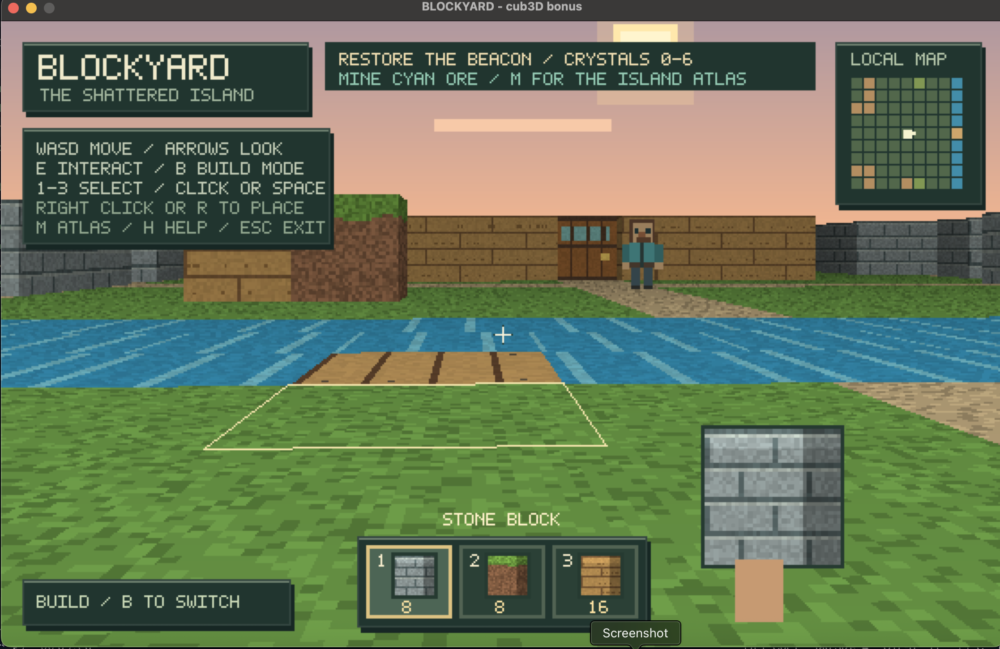
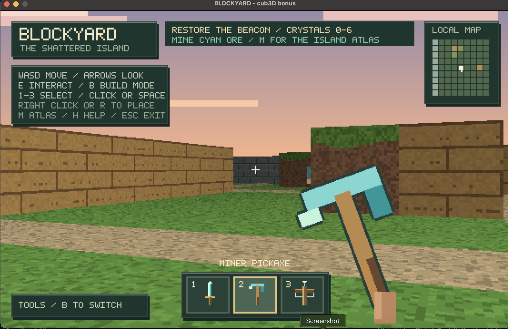

<div align="center">

# BLOCKYARD

### The Shattered Island

**Explore a little world. Mine your materials. Build your way across.**

A Minecraft-inspired island adventure built in C on top of a cub3D raycaster.

**C &nbsp; / &nbsp; MiniLibX &nbsp; / &nbsp; macOS &nbsp; / &nbsp; Raycasting**

[Play](#quick-start) · [The adventure](#the-adventure) · [Controls](#controls) · [Under the hood](#under-the-hood)

</div>



<p align="center"><em>A sunset, an unfinished bridge, and an island waiting to be explored.</em></p>

---

## The adventure

An ancient beacon stands silent in the island ruins. Its **six crystal shards** are scattered across a village, a quarry, wooded groves, and the far riverbank. Take your pickaxe, gather what you need, and find a way across.

| Explore | Make it your own |
| :--- | :--- |
| **An island to discover** — a 43 × 31 map with cabins, ruins, a quarry, and a watchhouse. | **Mine and build** — collect stone, grass, and timber, then place your own blocks. |
| **A reason to cross the river** — three crystals lie on the far bank. | **Bridge the gap** — use timber to extend the unfinished pier over water. |
| **A world in motion** — wandering characters, sliding doors, drifting clouds, and a glowing beacon. | **Choose your tools** — switch between a diamond sword, miner pickaxe, and oak crossbow. |

### Your first expedition

1. **Gather.** Equip the pickaxe with **2**, face a nearby block, and hold **Space** to mine it.
2. **Build.** Press **B**, choose a material with **1–3**, then **right click** or press **R** to place it.
3. **Cross.** Place over water to build a timber bridge. Each bridge tile costs one timber block.
4. **Discover.** Press **M** to open the atlas. Cyan tiles mark crystals; purple marks the beacon.
5. **Restore.** Mine all six cyan crystal blocks, then face the beacon in the southeastern ruins and press **E**.

You start with **8 stone · 8 grass · 16 timber**. After restoring the beacon, you can keep exploring and building.



<p align="center"><em>The miner pickaxe: your first tool for changing the world.</em></p>

## Quick start

### Requirements

- **macOS**, with Xcode Command Line Tools (`cc` and `make`).
- The macOS MiniLibX source in [`mlx/`](mlx/); the Makefile builds it locally and links OpenGL and AppKit.
- **Python 3** if you want to run the map-validation checks.

From the project directory:

```sh
make run-blockyard
```

To build and launch separately:

```sh
make bonus
./cub3D_bonus maps/island.cub
```

Run from the project root so relative map and texture paths resolve correctly.

### Choose a map

| Experience | Command |
| :--- | :--- |
| **The Shattered Island** — mining, building, and the six-crystal quest | `./cub3D_bonus maps/island.cub` |
| **Blockyard village** — the smaller bonus demo | `./cub3D_bonus maps/blockyard.cub` |
| **Classic cub3D** — the mandatory raycaster | `make && ./cub3D maps/map.cub` |

## Controls

| Key / input | Action |
| :--- | :--- |
| **W A S D** | Walk and strafe |
| **← / →** | Turn left / right |
| **↑ / ↓** | Look up / down |
| **E** | Open or close a nearby door; activate the beacon |
| **B** | Switch between tools and build mode |
| **1 / 2 / 3** | Tools: **sword / pickaxe / crossbow** · Building: **stone / grass / timber** |
| **Left click / Space** | Use your tool; hold Space to repeat or mine |
| **Right click / R** | Place a block or bridge in build mode |
| **Mouse wheel** | Cycle tools or building materials |
| **M** | Cycle local minimap → island atlas → hidden |
| **H** | Show or hide the controls overlay |
| **Esc / close window** | Exit |

## Mining, building & encounters

### Every block has a use

| Material | Strikes to mine | What you receive |
| :--- | :---: | :--- |
| Grass / dirt | 1 | A grass block |
| Stone | 2 | A stone block |
| Timber | 2 | A timber block |
| Cyan crystal ore | 3 | A stone block and one quest crystal |

In build mode, the ground outline marks the selected cell. Aim at a nearby wall to place beside it, or toward open ground to build ahead. Near water, placement targets the nearest unbridged tile and uses timber.

Placed walls can be mined again. Map boundaries and door frames are protected, and placement keeps your space, characters, character spawns, doors, and the beacon clear.

### Meet the locals

Characters wander around walls and closed doors. They are **training targets**: they flash when hit and respawn five seconds after being knocked down. They do not attack you.

The sword has short reach, the pickaxe has a slower, stronger melee hit, and the crossbow attacks at range. Crossbow hits are instant; walls and closed doors block attacks. Doors become walkable when fully open and stay open while someone occupies the doorway.

> **Current scope:** this is a single-level raycast world. You can place walls and bridges, but there is no vertical block stacking or terrain digging. Bridge decks last for the session. World edits and inventory reset when you quit.

## Under the hood

The bonus game uses a DDA raycaster with a depth buffer for character occlusion. Original pixel textures, equipment, bitmap lettering, and the sky are drawn procedurally in C. Movement and animation use elapsed time to keep their speed consistent across frame rates.

```text
cub3dd/
├── mandatory/           Classic cub3D parser and raycaster
├── bonus/
│   ├── blockyard/       World, rendering, characters, building, input, HUD
│   ├── includes/        Shared types and game interfaces
│   ├── parse_bonus/     Bonus map parsing and validation
│   └── raycasting_bonus/ MiniLibX setup and raycasting helpers
├── maps/                Island adventure, village demo, classic map
├── texture/             XPM textures for the classic renderer
├── libft/               C utility library
├── mlx/                 Local macOS MiniLibX dependency
├── tests/               Gameplay and map-validation checks
└── docs/images/         In-game screenshots
```

<details>
<summary><strong>Create a bonus map</strong></summary>

Keep the `.cub` header with four texture paths and floor/ceiling colors, followed by a closed map. The bonus artwork is procedural and does not use the four header textures; the classic renderer uses the XPM files.

| Tile | Meaning |
| :---: | :--- |
| `0` | Walkable ground |
| `1` | Stone wall |
| `2` | Grass / dirt block |
| `3` | Timber wall |
| `4` | Cyan crystal ore |
| `D` | Wooden door; needs walls on two opposite sides |
| `P` | Wandering character spawn |
| `~` | Water; blocks movement until bridged |
| `b` | Walkable timber bridge |
| `T` | Beacon; activates after all crystal ore is collected |
| `N S E W` | Exactly one player spawn, with its starting direction |

Close the outer boundary with `1` tiles and keep walkable areas away from void spaces. Up to **128 doors** and **64 characters** are supported. See [`maps/island.cub`](maps/island.cub) for the complete adventure map.

</details>

<details>
<summary><strong>Run checks and capture a frame</strong></summary>

```sh
make check-blockyard
```

The suite checks doors, collision, frame-rate-independent movement, character occlusion, attacks, respawning, mining, inventory, bridge building, and beacon completion. Map fixtures cover valid and malformed layouts; the island check verifies crystal reachability and the route across the river.

To render a PPM image without opening a window:

```sh
make bonus
CUB_CAPTURE=/tmp/blockyard.ppm ./cub3D_bonus maps/island.cub
```

To remove build artifacts:

```sh
make clean     # Project and libft object files
make fclean    # Also remove game executables and libft archive
```

</details>

---

<p align="center">
  <strong>Find the shards. Build the crossing. Light the beacon.</strong><br>
  <sub>A cub3D adventure with original procedural artwork and in-game screenshots.</sub>
</p>
